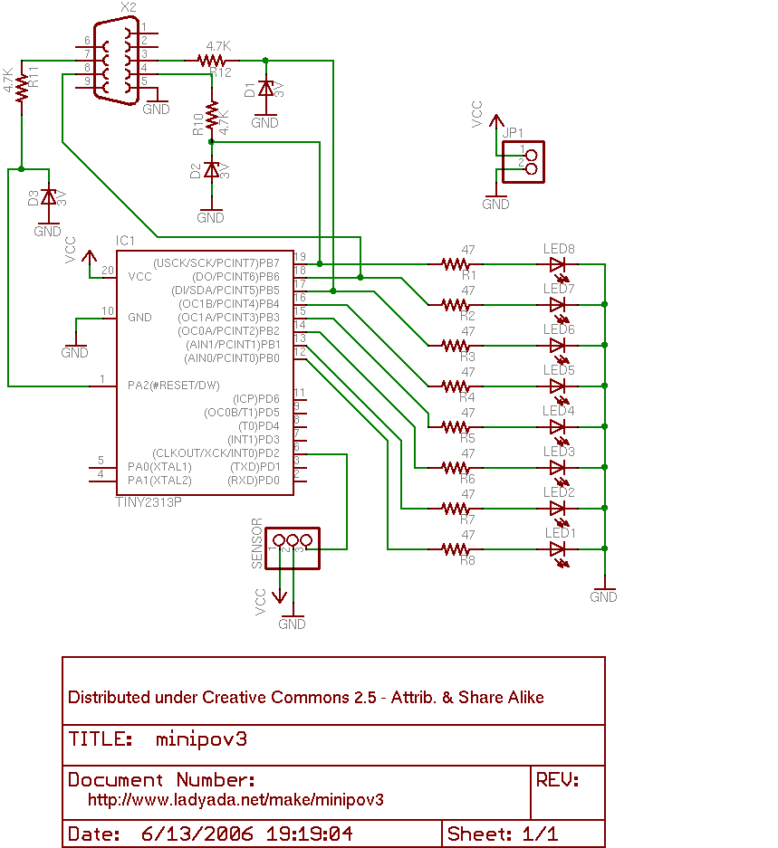

minipov3
==

This is everything i found around minipov. It seems
[ladyada](http://ladyada.net/make/minipov3/index.html) created this wonderful
peace of hardware.

Fine instructions can be found at [instructables](https://www.instructables.com/MiniPOV3-Kit/).

Base
--

Base information can be found on the original wiki at [adafruit](https://learn.adafruit.com/minipov3).

All code using the original function of the minipov are named `pov_*.c`.

You can use the device for just linear LED animations as well. This is not only nice for testing.

All code providing such animations of the minipov are named `ani_*.c`.

Mods
--

The nice thing about the device is the fact that you can program the CPU with
just a RS232 provided by older PCs out of the box or with an USB converter. It
utilises just 3 diods, 3 resitors and a DB9 plug to make that work (be aware
that this doesnt really use the serial capabilities of the RS232 but pulls the
information over the status lines of the interface, a method called
bitbanging).



Mitch Altman from
[cornfieldelectronics](http://cornfieldelectronics.com/cfe/projects.php)
developed alot of mods on minipov3.

### LEDcube

I bought the minipov3 with a kit for the
[LEDcube](http://cornfieldelectronics.com/cfe/projects/ledcube/LEDcube_instructions.php)
which i wasn able to finish yet.

All code using the LEDCube function of the minipov are named `cube_*.c`.

### RGBLight

Troubleshooting
--

### Bitbanging

It seems the Bitbanging timing depends on the speed of the host computer. If you encounter this message:

```
avrdude: AVR device not responding
avrdude: initialization failed, rc=-1
	Double check connections and try again, or use -F to override
	this check.
```

it may be that (if everything else is in place, the cpu powered and connected)
the timing must be changed. I put the macro `AVRDUDE_TIMING` into the makefile
for that. Raise the value and check again.

