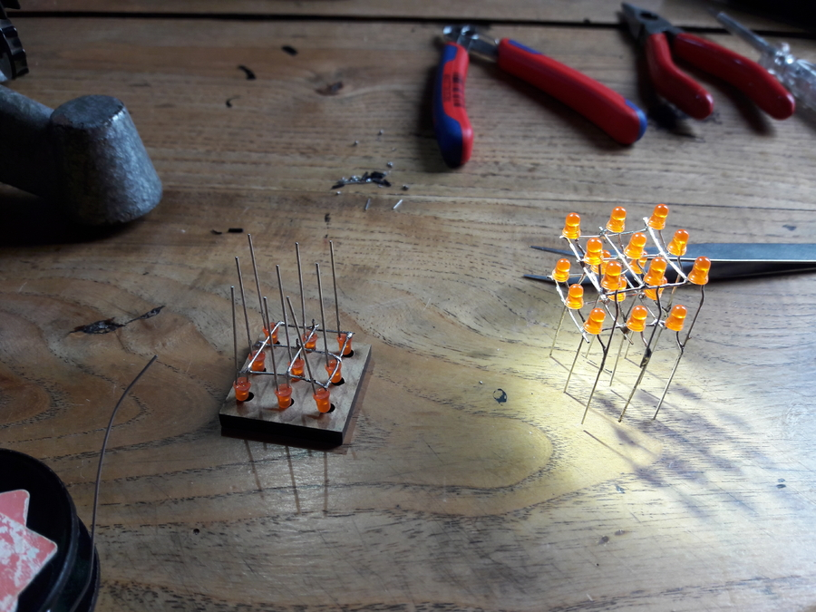

# Cube

I bought the minipov3 with a kit for the
[LEDcube](http://cornfieldelectronics.com/cfe/projects/ledcube/LEDcube_instructions.php)
from [Mitch](mitch@CornfieldElectronics.com) which i wasnt able to finish yet.

[Cornfieldelectronics projects](http://cornfieldelectronics.com/cfe/projects.php)

[Cornfieldelectronics LEDcube instructions](http://cornfieldelectronics.com/cfe/projects/ledcube/LEDcube_instructions.php)

Code using the LEDCube function of the minipov3:

- `cube_image.c`
- `cube_test.c`

I got the cube this far when i noticed that i confused anode and catode:

