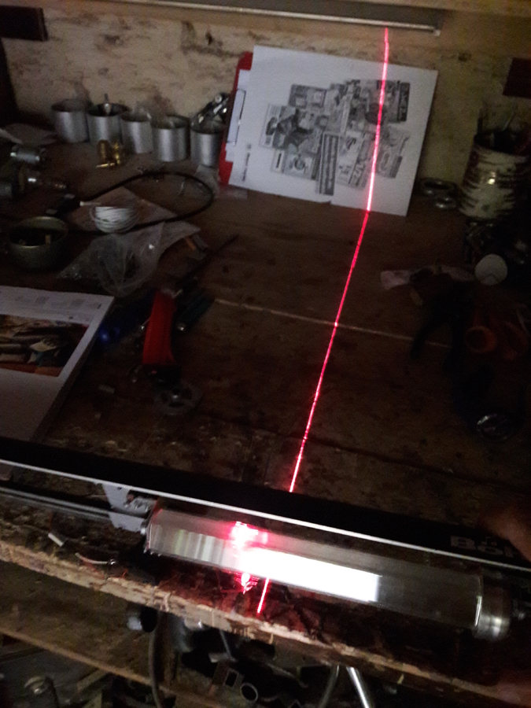

# Laser printer

## Idea

The idea for this project is quite old (around 20y) when i was programming a
c504 processor. Later i found the minipov3 (around 5y ago) and now i started to
program the attiny and found that both projects have alot in common.

Back then i thought that one could use 8 laser pointers and a turning mirror to
write sentences on the wall. I never implemented that idea but had 10
laserpointers laying around.

When i started to play around with the minipov i discovered that this was the
same idea with LEDs and my arm instead of the turning mirror. So i started to
implement that old idea based on minipov's attiny.

## Number

For this project i needed some measurements (like how long does one sequence
take?) to be somehow transfered out of the minipov. The arduino has a serial
connection all the time for that, the minipov doesnt.

But how do i get debuginformation out of the minipov?

The minipov is a display! It can write anything not only a fixed text, even
numbers, we just need a "font" (instead of the fixed pattern) to print the
number into the air.

So now i know a cycle uses `13 * 10ms`.

## Mirror

