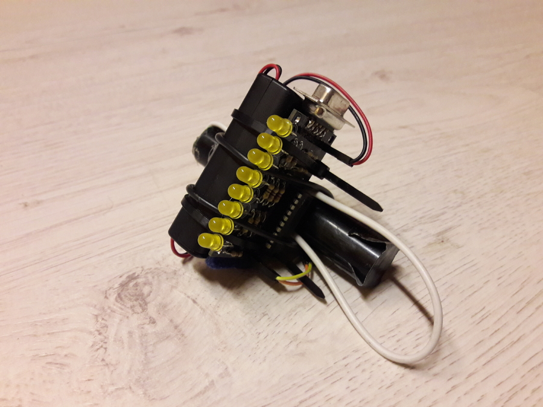

# POV

All code using the original function of the minipov are named `pov*.c`.

To generate an textline for `pov__.c` the programm `../gen_pov.c` is provided.

### POV with sensor

To know when to start the writing the minipov utilizes a sensor port. We
experimented alot with different switches and weights to trigger the switch
with no success.

Finally we used a reed contact and a small magnet in a tube.
This works incredible fine. Sampleprograms are in `pov/pov_sensor*.c`.

